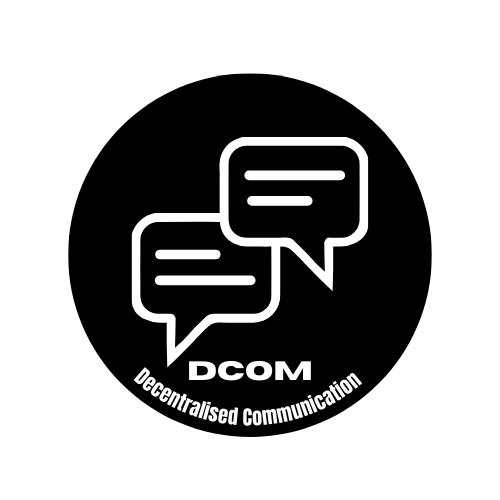

# DCOM - Decentralised Communication

A seamless real-time chat application built with FastAPI for the backend and Next.js for the frontend. This application supports both browser-based and terminal clients, providing a versatile communication platform.



## Features

- ⚡ Real-time messaging using WebSockets
- 💻 Support for both browser and terminal clients
- 🔔 User join/leave notifications
- 🎨 Clean, responsive UI for web clients
- 📱 Mobile-friendly design

## Tech Stack

### Backend
- **FastAPI** - Modern, high-performance web framework for building APIs
- **WebSockets** - For real-time bidirectional communication
- **Python 3.8+** - For server-side logic

### Frontend
- **Next.js** - React framework with server-side rendering
- **TypeScript** - For type safety and better developer experience
- **Tailwind CSS** - For responsive, utility-first styling

## Getting Started

### Prerequisites

- Python 3.8+
- Node.js 14+
- npm or yarn

### Installation

#### Backend Setup

```bash
# Navigate to backend directory
cd backend

# Create a virtual environment
python -m venv venv
source venv/bin/activate  # On Windows: venv\Scripts\activate

# Install dependencies
pip install fastapi uvicorn websockets

# Start the server
uvicorn server:app --reload --host 0.0.0.0 --port 8000
```

#### Frontend Setup

```bash
# Navigate to frontend directory
cd frontend

# Install dependencies
npm install

# Run the development server
npm run dev
```

### Accessing the Application

- **Web client**: Open your browser and navigate to `http://localhost:3000`
- **Terminal client**: Use a WebSocket client like wscat
  ```bash
  npm install -g wscat
  wscat -c ws://127.0.0.1:8000/ws
  ```

## Usage

### Browser Client

1. Enter your username and click "Join"
2. Type messages in the input field and press Enter or click "Send"
3. Messages from other users appear in real-time
4. System notifications show when users join or leave

### Terminal Client

1. Connect using wscat: `wscat -c ws://127.0.0.1:8000/ws`
2. Enter your username when prompted
3. Start chatting by typing messages and pressing Enter
4. Notifications to show when users join or leave

## Project Structure

```
.
├── .gitignore
├── LICENSE                     # Project license
├── README.md
├── backend
    └── server.py               # FastAPI WebSocket server
└── frontend
    ├── README.md
    ├── next-env.d.ts
    ├── next.config.ts
    ├── package-lock.json
    ├── package.json
    ├── postcss.config.mjs
    ├── public
        ├── favicon.ico
        └── logo.png
    ├── src
        └── app
        │   ├── globals.css
        │   ├── layout.tsx
        │   └── page.tsx        # Main chat page component
    └── tsconfig.json
```

## Contributing

Contributions are welcome! Feel free to open issues or submit pull requests.

1. Fork the repository
2. Create your feature branch (`git checkout -b feature`)
3. Commit your changes (`git commit -m 'Added some amazing feature'`)
4. Push to the branch (`git push origin feature`)
5. Open a Pull Request

## License

This project is licensed under the MIT License - see the LICENSE file for details.